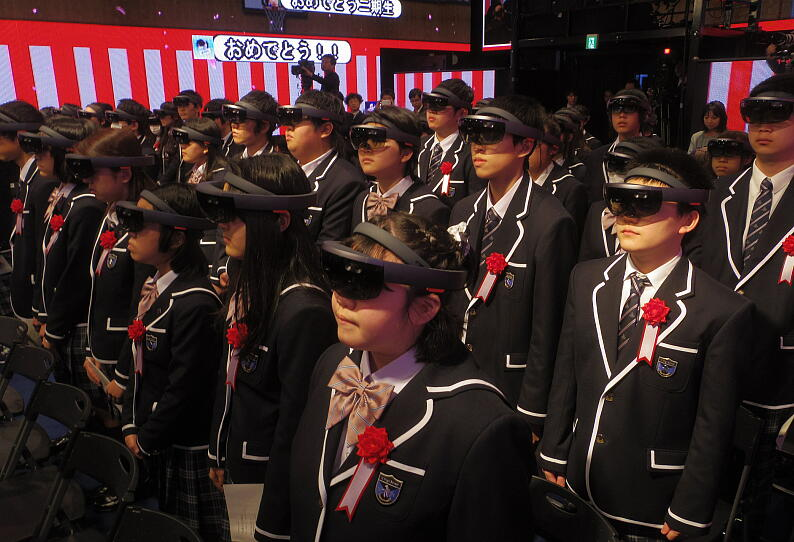
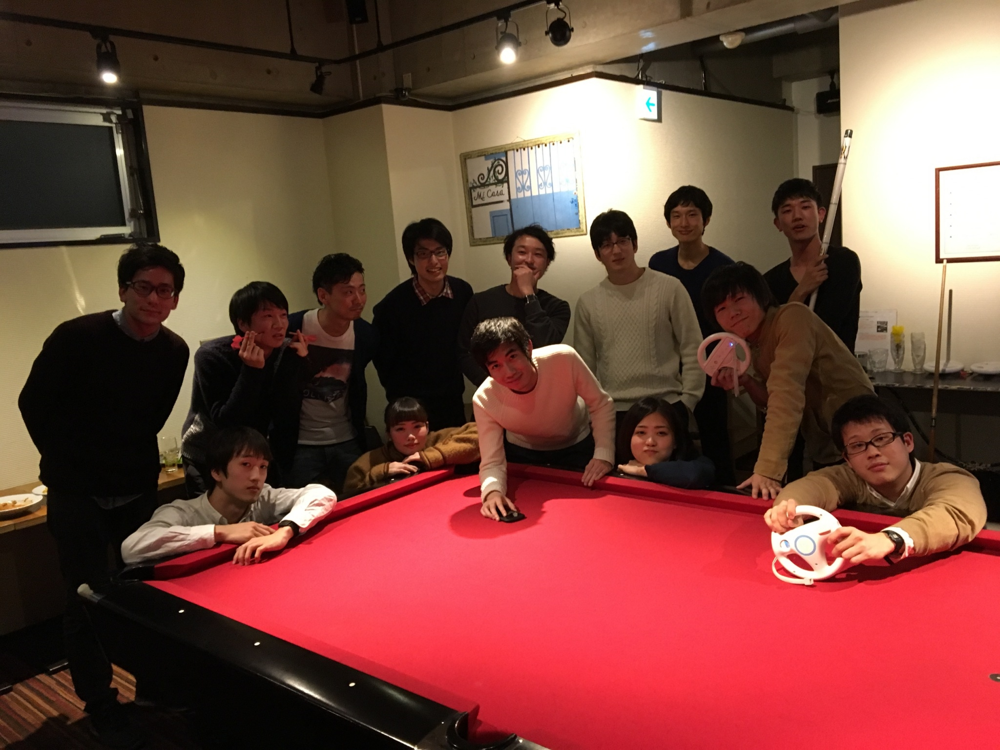
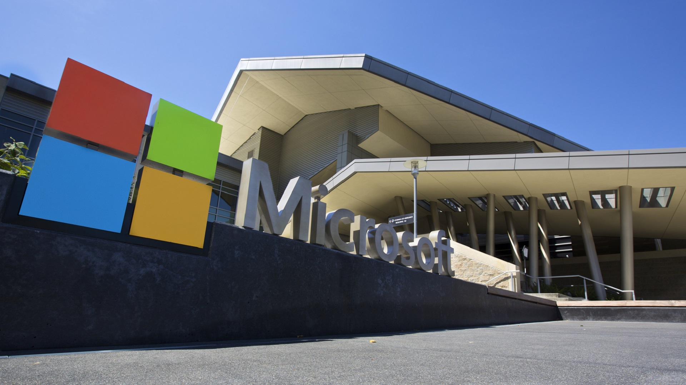
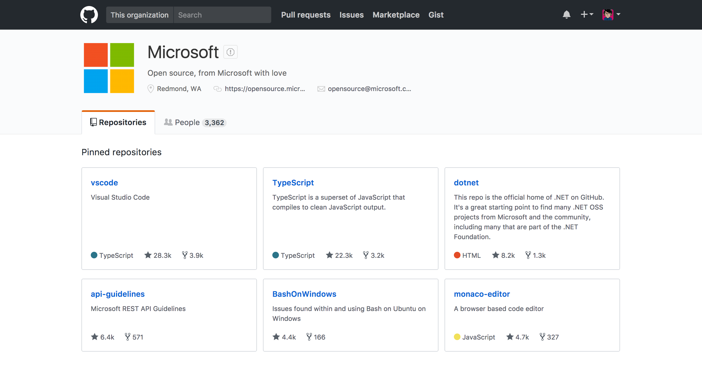

<!-- $theme: gaia -->
<!-- $size: 16:9 -->

## vsLT
# ==Juice Sponsor Talk==
#### Shun Tamura (@Tamrin007)

---

# About me

田村 俊 (たむりん、 [@Tamrin007](https://twitter.com/Tamrin007))

- 同志社大学大学院
- 好きな言語： Go, Ruby

---

# Talk Theme

1. アルバイトの宣伝
1. サマーインターンシップの紹介

---

# N 高等学校通学コース

<!-- *template: invert -->

---

# N 高等学校

2017 年度から代々木、心斎橋に**通学コース**が開設

- 高卒資格を得るためのネット授業
- Advanced Program (Programming etc...)
- 著名人を招いた特別授業
	- 夏野剛氏、まつもとゆきひろ氏 etc...
- Slack, G Suite などの IT ツールの活用

---

<!-- *template: gaia -->

# プログラミングチューター
# 募集

---

# プログラミングチューター

- 8:30 - 18:00 の交代シフト制（週 1 日から）
	- 8:30 - 13:30, 13:30 - 18:00 がベース
- プログラミング指導、キャンパス運営業務
- 月 1 回程度の**懇親会**あり
- 時給 **¥2,000** 、交通費支給
- 裁量の大きいアットホームな職場です！

---

---

<!-- *template: invert -->

# Microsoft
## Summer Internship 2017

---

<!-- *template: invert -->

# いま Microsoft は
# めちゃくちゃおもしろい

---

<!-- *template: invert -->

# WaaS
### Windows as a Service

---

<!-- *template: invert -->

# Intelligent Cloud
### 全ての製品に知性を

---

<!-- *template: invert -->

# Collaborative Computing
### Hololens, Cross Platform

---

<!-- *template: invert -->

# Microsoft ♡ Linux, OSS

---

<!-- *template: invert -->

---

<!-- *template: invert -->

# 募集職種

### 技術職 (MS)

- コンサルタント、エンタープライズサポートなど
- 月 35 万円 + 住居 + Surface Pro 4

### 開発職 (MSD)

- プログラムマネージャ、ソフトウェアエンジニア
- 月 40 万円 + 住居
